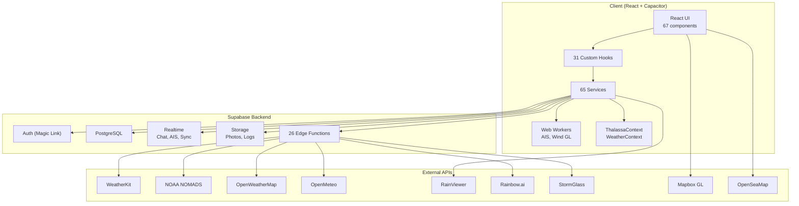
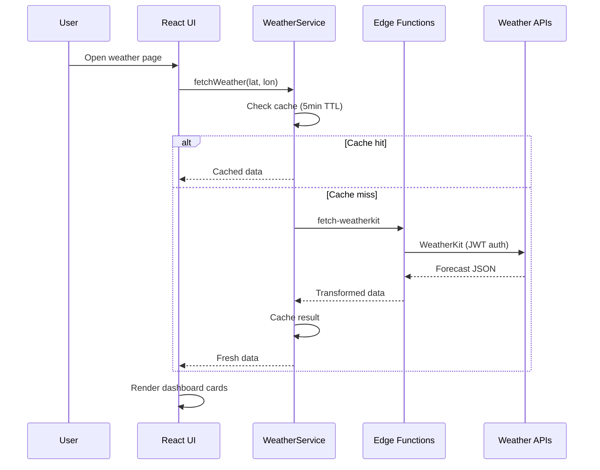
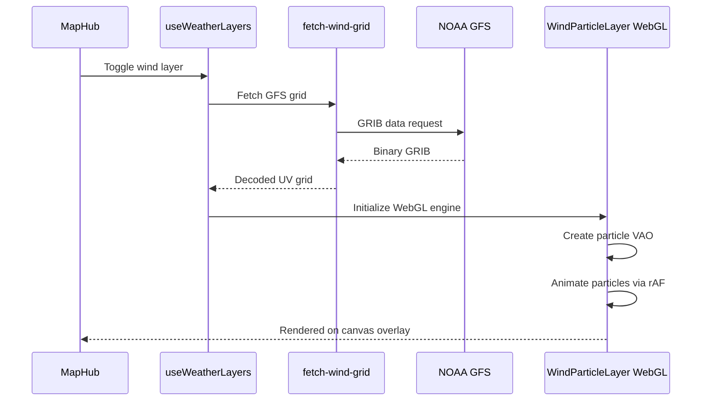

# Thalassa Architecture

## System Overview



## Data Flow: Weather



## Data Flow: Wind Particles



## Component Hierarchy

```mermaid
graph TD
    App["App.tsx"] --> Router
    Router --> Dashboard["Dashboard"]
    Router --> MapHub["MapHub"]
    Router --> Chat["ChatPage"]
    Router --> Anchor["AnchorWatchPage"]
    Router --> Guardian["GuardianPage"]
    Router --> Diary["DiaryPage"]
    Router --> Settings["SettingsModal"]

    Dashboard --> HeroSlide
    Dashboard --> TideVessel
    Dashboard --> ForecastSheet

    MapHub --> MapInit["useMapInit"]
    MapHub --> WeatherLayers["useWeatherLayers"]
    MapHub --> PassagePlanner["usePassagePlanner"]
    MapHub --> LayerFAB["LayerFABMenu"]
    MapHub --> VesselSearch

    Chat --> ChannelList
    Chat --> ChatMessages
    Chat --> ChatDMView
    Chat --> CrewFinder
    Chat --> Marketplace
    Chat --> IntelTicker["MaritimeIntelCard"]

    Anchor --> SwingCircle["SwingCircleCanvas"]
    Anchor --> AlarmOverlay["AnchorAlarmOverlay"]
    Anchor --> ScopeRadar
    Anchor --> ShoreWatch["ShoreWatchModal"]

    Settings --> GeneralTab
    Settings --> AccountTab
    Settings --> VesselTab
    Settings --> AlertsTab
    Settings --> AestheticsTab
    Settings --> LocationsTab
    Settings --> PolarManager["PolarManagerTab"]
```



## Service Architecture

### Core Services

| Service              | Lines  | Responsibility                                        |
| -------------------- | ------ | ----------------------------------------------------- |
| `WeatherService`     | ~400   | Multi-source weather orchestration with caching       |
| `ChatService`        | ~1,400 | Supabase Realtime messaging, DMs, moderation          |
| `IsochroneRouter`    | ~1,370 | Offshore weather routing with wind-angle optimization |
| `ShipLogService`     | ~1,990 | Voyage logging, GPS tracks, export (GPX/KML/CSV)      |
| `AnchorWatchService` | ~500   | GPS geofencing, swing radius, drag detection          |
| `GpsService`         | ~400   | Capacitor GPS with external device support (Bad Elf)  |
| `AisStreamService`   | ~300   | Real-time AIS via Supabase, vessel tracking           |
| `GuardianService`    | ~300   | Vessel security monitoring, geo-fence alerts          |
| `AlarmAudioService`  | ~200   | Web Audio API alarm with haptic feedback              |

### Weather Data Pipeline

```
WeatherKit (primary)
    -> JWT auth via Edge Function
    -> Hourly + daily forecasts
    -> Cached 5min in-memory + localStorage

NOAA NOMADS (fallback)
    -> GRIB binary data via Edge Functions
    |-- Wind UV grids -> WebGL particle engine
    |-- Pressure grids -> isobar contour lines
    +-- Precipitation grids -> rain overlay

OpenMeteo (free tier)
    -> Direct client API calls
    +-- Marine forecasts, wave data

RainViewer (radar) + Rainbow.ai (forecast)
    -> XYZ tile overlays
    +-- Unified scrubber timeline (past radar + future forecast)

OpenWeatherMap
    -> Direct tile API (requires API key)
    +-- Temperature + cloud overlays
```

### Routing Engine

The passage planner uses a two-stage approach:

1. **Coastal Corridors (A\*)** — Safe-water pathfinding avoiding land, using GEBCO depth data
2. **Offshore Isochrone** — Weather-optimized routing using GFS wind forecasts and vessel polar data

## Database Schema (Supabase PostgreSQL)

Key tables:

| Table               | Purpose                             |
| ------------------- | ----------------------------------- |
| `profiles`          | User profiles with vessel info      |
| `channels`          | Chat channels (public, private, DM) |
| `messages`          | Chat messages with read receipts    |
| `crew_listings`     | Crew finder profiles                |
| `marketplace_items` | Items for sale with escrow          |
| `voyage_logs`       | Ship's log entries                  |
| `community_tracks`  | Shared GPS voyage tracks            |
| `ais_positions`     | Recent AIS vessel positions         |
| `guard_zones`       | Guardian geo-fence definitions      |
| `weather_alerts`    | Automated severe weather alerts     |

## Security Model

- **API keys** proxied through Supabase Edge Functions (never in client bundle)
- **Authentication** via Supabase Auth (magic link email)
- **Row-Level Security (RLS)** on all database tables
- **Content moderation** via `ContentModerationService`
- **CSP headers** configured in deployment
- **No `dangerouslySetInnerHTML`** usage
- **`.env` in `.gitignore`** — no secrets in source

## Performance Optimizations

- **662 `useMemo`/`useCallback`** calls for render optimization
- **Lazy loading** via `React.lazy()` for all route-level components
- **Web Workers** for AIS data ingestion (off-main-thread)
- **WebGL** particle engine for wind visualization (60fps)
- **`createLogger`** with `esbuild.drop` removing all `console.*` in production
- **Virtualized lists** for AIS vessel tables
- **Static tile caching** via service worker

## Accessibility

- **300+ ARIA attributes** across components
- **Global focus-visible rings** (sky-400 2px ring on keyboard focus)
- **Skip-to-content** CSS link
- **Semantic HTML** with `<nav>`, `<main>`, `<section>` landmarks
- **Color contrast** WCAG AA compliance on interactive labels
- **Keyboard navigation** on all interactive elements
- **Screen reader announcements** via `aria-live` regions
